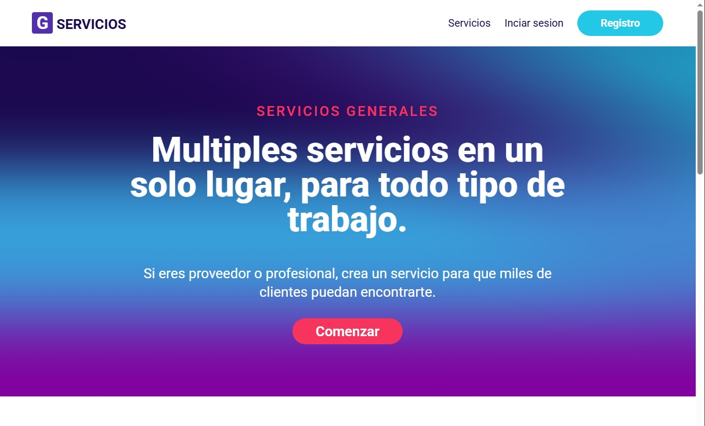
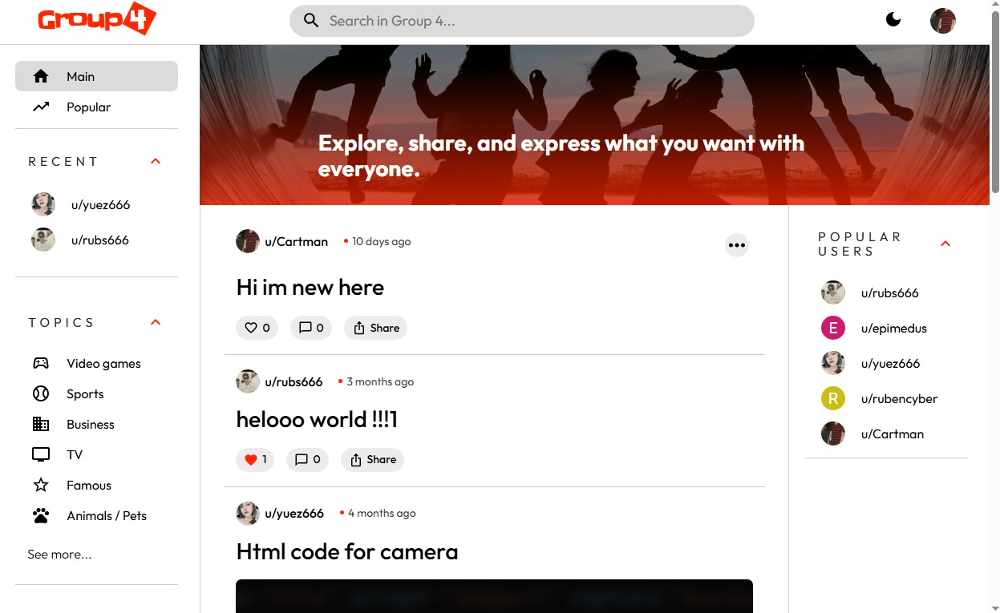
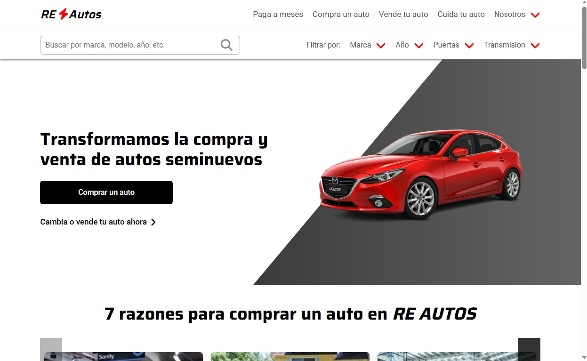
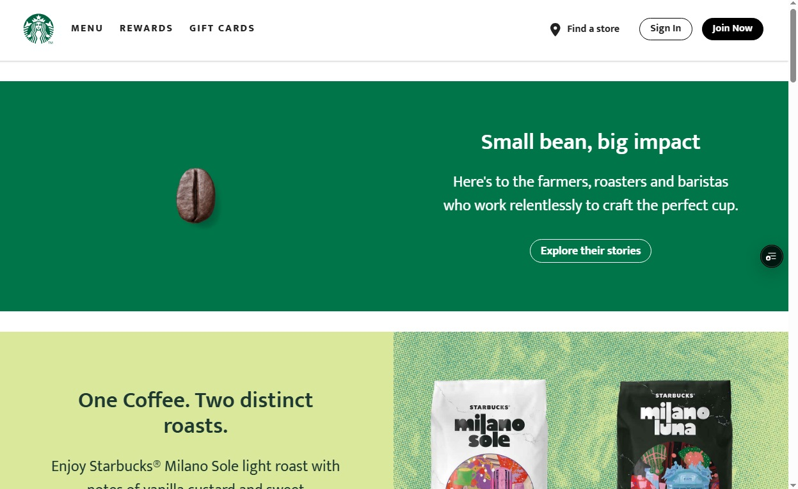
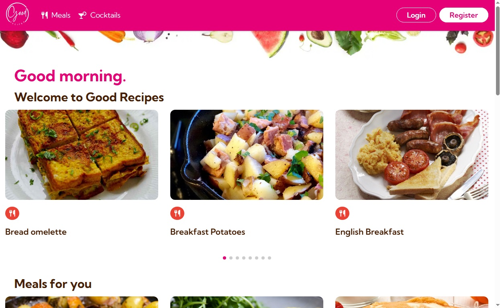

# Hola, mi nombre es Rubén

---
## **¿Quién soy?**
Soy un desarrollador frontend apasionado por construir experiencias web modernas, rápidas y funcionales utilizando **React** como herramienta principal. Me encanta aprender nuevas tecnologías, colaborar en proyectos emocionantes, colaborar con otros desarrolladores y afrontar retos y soluciones que me permitan crecer profesionalmente.

Actualmente estoy estudiando **desarrollo backend** a profundidad con **Java** y **bases de datos SQL**. Tambien estudio constantemente sobre temas mas teóricos y avanzados sobre el desarrollo de software en general.

**¿Que estas buscando?**
- [Contactame](#contactame)
- [Proyectos destacados](#proyectos-destacados)
- [Skills](#habilidades-tecnicas)

## **Contactame**

- Email: **rubdeveloper476@gmail.com**
- [Linkedin](https://g-services.vercel.app/)

## 💻🚀 **Proyectos destacados** (Todos mis proyectos se actualizan y se mejoran constantemente)

### 1. **G-Servicios**
Sitio web para ofrecer servicios generales de cualquier tipo.

- **Características**:
    - Login, registro y edicion de perfil de usuarios.
    - CRUD de servicios.
    - Subida de imagenes.
    - Rutas dinamicas y privadas.
    - Filtro de busqueda de servicios.
- **Tecnologías:** React con Next js, Tailwindcss, Python, Flask, SQLite y cloudinary.
- **Enlaces:** [Repositorio](https://github.com/RubDev476/General-services) | [Demo](https://g-services.vercel.app/)

### 2. **Group-4**
Clon de reddit para publicar posts con imagen o sin imagen, como una red social moderna, donde la gente puede compartir sus pensamientos e ideas.

- **Características**:
    - Login, registro y edicion de perfil de usuarios.
    - CRUD de publicaciones.
    - Subida de imagenes.
    - Rutas dinamicas y privadas.
    - Lista de usuarios populares (quienes tienen mas likes y comentarios).
    - Lista de actividad reciente (usuarios a quienes le comentaste y le diste like recientemente).
- **Tecnologías:** React con Next js, Material UI y Firebase.
- **Enlaces:** [Repositorio](https://github.com/RubDev476/Group-4) | [Demo](https://group-4-rho.vercel.app/)

### 3. **RE-Autos**
Sitio web para venta de autos. (Diseño inspirado del sitio web **Kavak**)

- **Características**:
    - API de autos con multiples modelos y marcas.
    - Barra de busqueda.
    - Filtros avanzados (Marca, Año, Puertas, Precio, Color, etc.).
    - Landing Page.
    - Pruebas unitarias con Vitest y React Testing Library.
- **Tecnologías:** React con Next js, Sass, Swiper js, Vitest, React Testing Library y Redux Toolkit.
- **Enlaces:** [Repositorio](https://github.com/RubDev476/RE-Cars) | [Demo](https://re-cars.vercel.app/)

### 4. **Starbucks**
Clon de starbucks con API de productos.

- **Características**:
    - API de productos starbucks.
    - Landing Page.
    - Multiples categorias y subcategorias para explorar.
- **Tecnologías:** React con Vite, Sass y MongoDB.
- **Enlaces:** [Repositorio](https://github.com/RubDev476/starbucks-clone-api) | [Demo](https://starbucks-clone-amber.vercel.app/)

### 5. **Good recipes**
Sitio web de recetas usando las API's publicas de The CocktailDB y The MealDB. (Diseño inspirado del sitio web **Recetas Nestlé**)

- **Características**:
    - API's publicas de The CocktailDB y The MealDB.
    - Landing Page.
    - Carrusel dinámico que te recomienda recetas dependiendo la hora del dia (Desayuno, Almuerzo, o Cockteles si es de noche).
- **Tecnologías:** React con Vite, Styled Components y Swiper js.
- **Enlaces:** [Repositorio](https://github.com/RubDev476/Good-recipes) | [Demo](https://good-recipes-vert.vercel.app/)

## **Habilidades técnicas**
- **Lenguajes de programación:** 
    - JavaScript | Typescript | HTML | CSS | Sass 

- **Frameworks/Bibliotecas:** 
    - React js | Node js | Redux Tookit | Tailwind CSS | Styled components | Zustand | Vite

- **Pruebas unitarias:** 
    - React Testing Library | Jest | Vitest

- **Herramientas:** 
    - VS Code | WebStorm

- **Otros:** 
    - Responsive Design | Manejo de estado global | Consumo de API's | Conocimientos superficiales de backend y bases de datos Nosql (MongoDB y Firebase).

---