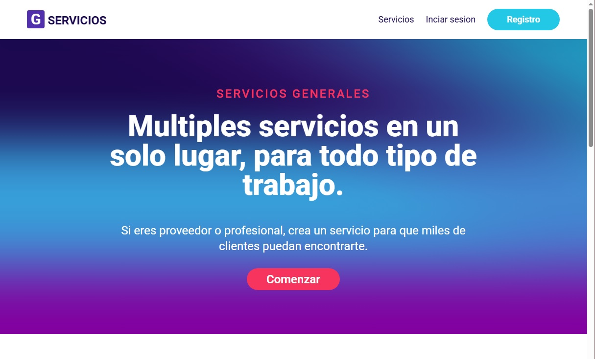
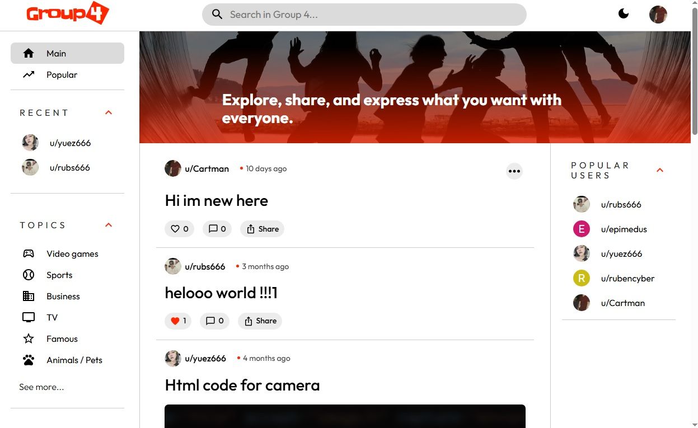
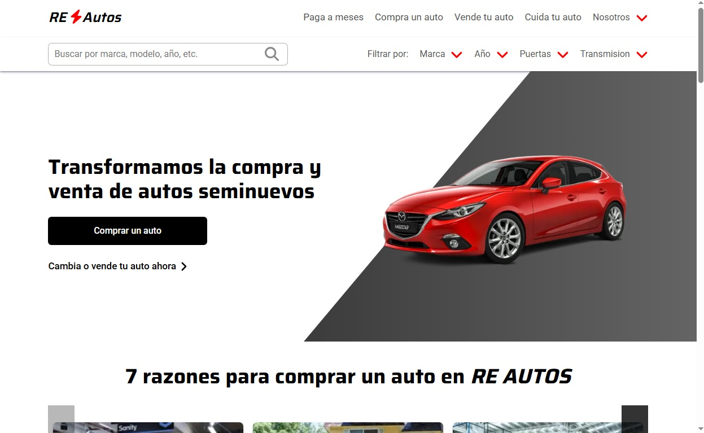
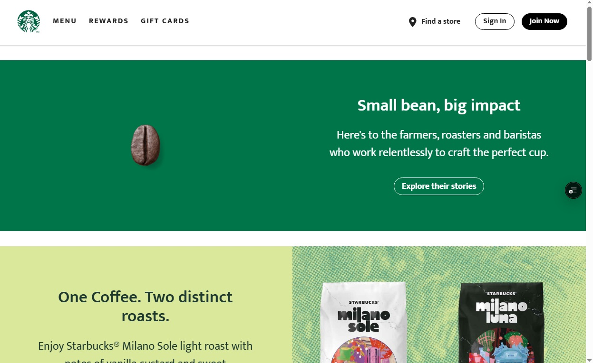
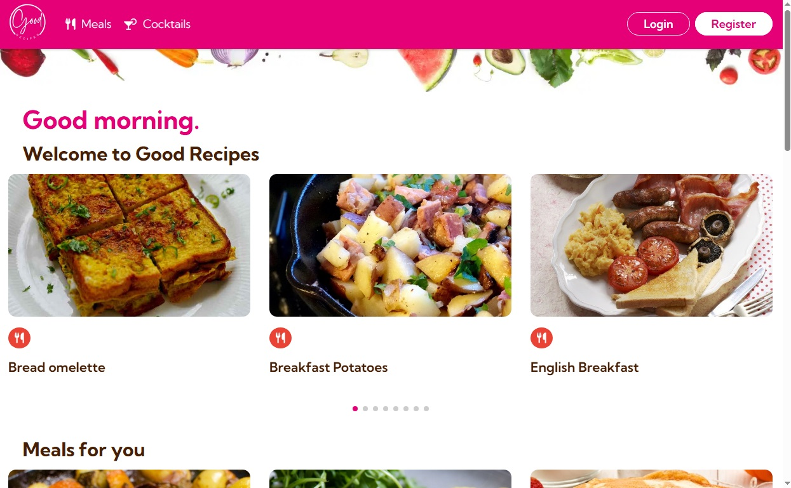

# Hola, te doy la bienvenida, mi nombre es Rubén

## **¿Quién soy?**
Soy un desarrollador full stack apasionado por construir experiencias web modernas, rápidas y funcionales utilizando el ecosistema de **React** y **Node js** como herramientas principales. Me encanta aprender nuevas tecnologías, colaborar en proyectos emocionantes, trabajar con otros desarrolladores y afrontar retos y soluciones que me permitan crecer profesionalmente.

También estudio constantemente sobre temas más teóricos y avanzados relacionados con el desarrollo de software en general cada dia y tengo un gran interes por el mundo del **Analisis de datos**.

## **¿Qué estás buscando?**
- [**Habilidades técnicas**](#habilidades-técnicas)
- [**Información de contacto**](#contáctame)
- [**Proyectos destacados**](#-proyectos-destacados-todos-mis-proyectos-se-actualizan-y-se-mejoran-constantemente)
    - [**G-Servicios**](#1-g-servicios)
    - [**Group-4**](#2-group-4)
    - [**RE-Autos**](#3-re-autos)
    - [**Starbucks**](#4-starbucks)
    - [**Good Recipes**](#5-good-recipes)

## **Habilidades técnicas**
- **Nivel de ingles**: B1 
- **Lenguajes**:  Javascript/Typescript | Java | SQL 
- **Bases de datos**: Mysql | MongoDB | Firebase | SQL Server
- **ORM’s:** TypeORM | Sequelize | Mongoose | Hibernate 
- **Backend**: Node js | Express | Swagger | JWT | OAuth 2.0 | Spring Boot |  Nest Js 
- **Frontend**: React | Next js | Redux toolkit | Sass | Tailwindcss | Styled Components 
- **Testing**: Jest | React testing library | Vitest 
- **Herramientas**: Git | Github | Postman | Vercel | Render | Supabase | Docker 
- **IDE’s**: VSCode | WebStorm | IntelliJ 

## **Contáctame**

- Email: **rubdeveloper476@gmail.com**
- [**LinkedIn**](https://www.linkedin.com/in/rubdev476/)

## 💻🚀 **Proyectos destacados** (Todos mis proyectos se actualizan y se mejoran constantemente)

### 1. **G-Servicios**
Sitio web para ofrecer servicios generales de cualquier tipo.

- **Características**:
    - Login, registro y edición de perfil de usuarios.
    - CRUD de servicios.
    - Subida de imágenes.
    - Rutas dinámicas y privadas.
    - Filtro de búsqueda de servicios.
    - Pruebas unitarias
- **Tecnologías:** React con Next js, TailwindCSS, Vitest, React Testing Library, Python, Flask, SQLite y Cloudinary.
- **Enlaces:** [**Repositorio**](https://github.com/RubDev476/General-services) | [**Demo**](https://g-services.vercel.app/)

### 2. **Group-4**
Clon de Reddit para publicar posts con imagen o sin imagen, como una red social moderna, donde la gente puede compartir sus pensamientos e ideas.

- **Características**:
    - Login, registro y edición de perfil de usuarios.
    - CRUD de publicaciones.
    - Subida de imágenes.
    - Rutas dinámicas y privadas.
    - Lista de usuarios populares (quienes tienen más likes y comentarios).
    - Lista de actividad reciente (usuarios a quienes les comentaste y les diste like recientemente).
- **Tecnologías:** React con Next js, Material UI y Firebase.
- **Enlaces:** [**Repositorio**](https://github.com/RubDev476/Group-4) | [**Demo**](https://group-4-rho.vercel.app/)

### 3. **RE-Autos**
Sitio web para venta de autos. (Diseño inspirado en el sitio web **Kavak**)

- **Características**:
    - API de autos con múltiples modelos y marcas.
    - Barra de búsqueda.
    - Filtros avanzados (Marca, Año, Puertas, Precio, Color, etc.).
    - Landing Page.
    - Pruebas unitarias con Vitest y React Testing Library.
- **Tecnologías:** React con Next js, Sass, Swiper js, Vitest, React Testing Library y Redux Toolkit.
- **Enlaces:** [**Repositorio**](https://github.com/RubDev476/RE-Cars) | [**Demo**](https://re-cars.vercel.app/)

### 4. **Starbucks**
Clon de Starbucks con API de productos.

- **Características**:
    - API de productos Starbucks.
    - Landing Page.
    - Múltiples categorías y subcategorías para explorar.
    - Mas de 240 productos.
- **Tecnologías:** React con Vite, Sass, Swagger y Postgresql alojado en Supabase (incluye una rama con MongoDB).
- **Enlaces:** [**Repositorio**](https://github.com/RubDev476/starbucks-clone-api) | [**Demo**](https://starbucks-clone-amber.vercel.app/)

### 5. **Good recipes**
Sitio web de recetas usando las APIs públicas de The CocktailDB y The MealDB. (Diseño inspirado en el sitio web **Recetas Nestlé**)

- **Características**:
    - APIs públicas de The CocktailDB y The MealDB.
    - Landing Page.
    - Carrusel dinámico que te recomienda recetas dependiendo de la hora del día (Desayuno, Almuerzo o Cócteles si es de noche).
- **Tecnologías:** React con Vite, Styled Components y Swiper js.
- **Enlaces:** [**Repositorio**](https://github.com/RubDev476/Good-recipes) | [**Demo**](https://good-recipes-vert.vercel.app/)

