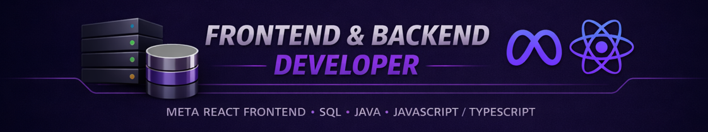

Soy un desarrollador full stack con mas de 4 años de experiencia en frontend y backend.  
Mi certificación profesional en **React (Meta)** y experiencia desarrollando proyectos freelancer respalda mi dominio en desarrollo frontend, mientras que mi experiencia laboral en **SQL Server, MySQL y NestJS** garantiza soluciones en el backend, además de contar con solidos conocimientos en **Java con Spring Boot**.

## 💻🚀 **Proyectos destacados**
- **Good Recipes:** [**Repositorio**](https://github.com/RubDev476/Good-recipes) | [**Demo**](https://good-recipes-vert.vercel.app/)
- **G-Servicios:** [**Repositorio**](https://github.com/RubDev476/General-services) | [**Demo**](https://g-services.vercel.app/)
- **Group-4:** [**Repositorio**](https://github.com/RubDev476/Group-4) | [**Demo**](https://group-4-rho.vercel.app/)
- **RE-Autos:** [**Repositorio**](https://github.com/RubDev476/RE-Cars) | [**Demo**](https://re-cars.vercel.app/)

## 🛠️ **Stack y resumen de habilidades:**
- **Nivel de ingles**: B2
- **JavaScript - TypeScript**: Node Js | React | Next Js | Nest Js | Express | Eslint
- **CSS**: TailwindCSS | Sass | Styled Components | Bootstrap  
- **SQL - NoSql**: Mysql | SQL Server | MongoDB | Firebase
- **Java**: Spring Boot | Spring Security | Hibernate | JPA | Lombok | Spring Web  
- **Testing**: Jest | React testing library | Vitest
- **Frontend**: Redux | Context API | Custom Hooks | Zustand
- **Backend**: JWT | OAuth 2.0 | Rest API | MVC | Microservicios
- **Herramientas**: Git | Github | Docker | Figma | VSCode | WebStorm | IntelliJ | Microsoft Copilot

## 🛠️ **Frontend:**
- **Maquetado y diseño responsivo con Flexbox y CSS Grid.**
- **Conocimiento sobre Figma para prototipado y mockups**
- **Experiencia con librerías y frameworks CSS: TailwindCSS, Material UI, Bootstrap, Sass, Styled Components.**
- **Desarrollo de interfaces modernas con React y Next.js y Vite, optimizadas para rendimiento, accesibilidad y SEO.**
- **Implementación de Redux, Context API, Zustand y Custom Hooks para gestión de estado global.**
- **Metodología "Mobile First"**
- **Uso de herramienta Lighthouse para monitoreo de rendimiento, accesibilidad y SEO**
- **Html semántico y metadatos para mejorar la accesibilidad y SEO**

## ⚙️ **Backend:**
- **Creación de APis RESTful. (CRUD, Endpoints)**
- **Documentación de APIs con Swagger y Postman.**
- **Implementación de autenticaciones seguras con OAuth 2.0 y JWT.**
- **Uso del patrón MVC y conocimientos en microservicios**
- **Experiencia con NestJS, Express y Java Spring Boot para servicios escalables.**
- **Uso de Orms como Sequelize Y TypeOrm**
- **Uso de almacenamiento multimedia en la nube con Cloudinary y Firebase**

## 🗄️ **Bases de Datos:**
- **Diseño y normalización de tablas.**
- **Consultas avanzadas con JOINS, CTEs, subqueries.**
- **Creación y optimización de Stored Procedures y Views**
- **Manejo de SQL Server, MySQL, MongoDB y Firebase.**
- **Optimización de queries para alto rendimiento en sistemas de producción.**

## 📬 Contáctame
- ✉️ Email: [rubdeveloper476@gmail.com](mailto:rubdeveloper476@gmail.com)  
- 💼 LinkedIn: [linkedin.com/in/rubdev476](https://www.linkedin.com/in/rubdev476/)  
